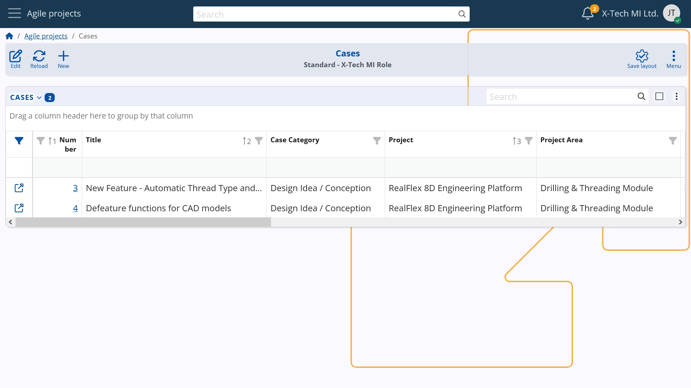

## Agile Project Management

# Overview

Creative industries such as software development have found out that their projects are most successful when carried out flexibly, through the agile method. 
But agile is no longer exclusive to IT – it’s becoming the standard for organizations that value adaptability. 
Nowadays this approach is becoming more common, entering marketing and advertising, banking and finance, education and other industries that feel the need to become more flexible and adapt their current projects to the constantly evolving market environment.

The Agile Project Management module of ERP.net is designed to let users easily apply agile project management - where work is done in small cycles with constant reviews and feedback.  
EPR.Net Agile PM offers businesses a range of benefits that help streamline the agile processes, improve team collaboration, and ensure that projects stay on track.

___

# How it Works

In Agile Project Management, the core operational unit is “Cases”. 
A Case represents a tightly focused, manageable piece of work within the broader project.
It functions as a dynamic work log that tracks the progress of a specific task from initiation to closure.

___

## The main tool: Cases

Each Case serves as a living document, capturing updates, decisions, and changes as the task advances. 
Once the work associated with the Case is completed and approved, the Case is formally closed, signifying task completion within the project.

This granular kind of task management lets organizations gain better control over scope, resources, and progress for every project. 
As each Case acts as a documented trail of work, it ensures that team members, stakeholders, and managers can see who did what and when. 
This supports auditability and accountability.

### Ownership

Еach Case is assigned an owner, who is the person responsible for its execution and completion.
By default, the creator of a Case becomes its initial owner. 
However, ownership can be reassigned to another user, allowing team members to create Cases on behalf of colleagues and delegate responsibility as needed.

This flexibility supports efficient workload distribution and ensures clear accountability, which leads to smoother collaboration and faster task resolution across teams.

### Detailed Description

When creating a new Case, the author is expected to provide a detailed Description.
This is entered through a markdown-enabled field that supports rich text formatting — including headings, bullet points, numbered lists, quotes, images, and file attachments — allowing for clear, structured, and visually organized content.

This enhances communication and reduces misunderstandings by ensuring that all relevant information is presented in a readable and professional format, leading to more efficient task execution and fewer follow-up questions.

### Priorities

When a new Case is created, the author estimates its initial priority level. 
If the assigned priority is 3 or higher (indicating lower urgency), the system automatically adjusts the Case's priority to level 2 once actual work begins — reflecting its increased relevance during execution.

This dynamic adjustment helps teams focus on active work items by elevating their visibility, ensuring that resources are allocated efficiently and critical tasks are not overlooked.

### Developments

From the moment a Case is created until it is closed, every action and update is automatically logged in the system. 
These logs are displayed in the Developments sub-panel. 
It provides a detailed timeline of all activities, including status changes, edits, and their respective authors.

The layout of this panel can be customized for better readability and focus. 
Any edits made to entries are also tracked, ensuring full transparency and traceability.

This comprehensive activity log enhances accountability, supports informed decision-making, and serves as a reliable audit trail. 
Teams can easily review what was done, by whom, and when — reducing miscommunication, simplifying handovers, and strengthening process compliance across the project lifecycle.

### Discussions

A distinctive feature of Agile PM in ERP.Net is the Case Discussion tab — an informal, built-in chat channel linked to each individual Case. 
This space allows team members to exchange quick messages, ask questions, resolve disputes, or share explanations without cluttering the formal Case documentation. 
While these discussions are kept separate from the official work log, they remain visible to all relevant users and are fully preserved for future reference.

Additionally, any new comment in the Discussion tab triggers a notification to involved users, ensuring timely collaboration and responsiveness.

This feature fosters transparent, real-time communication while maintaining the integrity of formal project records. 
It reduces reliance on external tools (like email or messaging apps), centralizes conversations around the work item, and ensures that critical context is never lost — improving decision-making, speeding up resolutions, and enhancing team alignment.

### Case Statuses

Every case has several consequent statuses that reflect the stage of work on the specific task. 
These statuses are called States:

*Backlog –> Consider –> Ready –> In progress –> Waiting –> Resolved –> Closed*

The user can change back and forward between these statuses.

The __Backlog__ gives the start of the Case; it usually contains the initial information - description of a task/problem/request, reasoning, possibly some imagery, author (owner).

The __Consider__ phase is the phase for evaluation: gathering additional information, surveying, detailing, testing, etc. 
This is usually done by some kind of responsible person or supervisor.

__Ready__ is the phase when a Case gets green light to be processed. 
At this stage it can be assigned to an employee who becomes responsible for the Case.

Once the employee accepts the task and starts work on the Case, it enters the __In progress__ status.
When the initial level of priority is 3 or higher, now that the Case enters “In progress” state, the priority will automatically get higher (priority level 2).

Whenever there is retardation on the work process, the Case enters the __Waiting__ status.
A common reason may be the need to wait for feedback from the customer. Starting active work again brings the Case __In Progress__ again.

After a resolution is achieved, the Case may be moved to __Resolved__ status.
In the end it is supposed to be __Closed__.

__Note: A Case cannot be closed without being resolved first.__

**_N.B.: A case that is already closed can no more be edited_**.

### Tasks
Each user involved in a Case can add personal Tasks (To-Do items) directly within the Case profile. 
These are small, routine action items that support the completion of the overall Case. 
Users can also assign these Tasks to other team members working on the same Case, enabling shared responsibility and collaboration on specific details.

This feature promotes personal accountability, helps structure daily work, and ensures that no minor steps are overlooked. 
It also enhances teamwork by enabling micro-level task delegation, leading to more organized, efficient, and transparent Case execution.

**_Note: A Case cannot be Resolved and Closed while having active/open Tasks._**

### Cases Hierarchy

Cases in Agile PM can be organized into a hierarchical structure, where a newly created Case may be subordinated to an existing Parent Case. 
This allows complex work to be broken down into smaller, more manageable sub-Cases.

The hierarchy is strictly maintained and clearly displayed, showing the full structure of parent and child Cases.

This hierarchical organization improves clarity, enables better tracking of dependencies, and helps project managers visualize the full scope of work. 
It also enhances reporting, prioritization, and resource allocation by showing how individual tasks contribute to broader project goals.

### Estimated time hours

Each Case summary can include an estimated number of work hours required to complete the task. 
This initial time estimate supports more accurate planning of resources, scheduling, and budgeting. 
As work progresses, the estimation can be updated to reflect new insights or changes in scope, ensuring it remains relevant throughout the Case lifecycle.

By providing a clear view of expected effort, time estimations help project managers balance workloads, avoid overloading, and allocate team capacity effectively. 
This leads to improved forecasting, cost control, and overall project efficiency.

___

## Setting up the Stage for Project Management

To start managing projects with ERP.net, Project Areas, project Types and Case Categories must be defined in advance. 
The definitions are to be decided by the organization itself, while the setup could be done either by the implementation partner or the internal admin.

### Project types

Project Types are prerequisites for the creation of particular Projects and hence for the creation of Cases for these projects.

Every Project Type defines a general kind of projects characterized by certain parameters that are common for a whole group of Projects. 
*E.g. a marketing agency would often work on website development for different customers; hence, “Website Development” could be a Project Type for a marketing agency.* 

*__Note:__*

A type of project is NOT a business-division.

A type of project is NOT a type of product or service.

A type of projects is NOT a particular project. 

A type of project is a __fundamental category__ of projects according to the internal taxonomy of activities at the organization.

*E.g. a project type at a marketing agency could be: campaign launch, social media strategy, website redesign, etc.*

*Project Types at a bank could be: mobile app development, regulatory compliance update, loan process enhancement, etc.*

*Every company is supposed to have its own typology of the projects that it runs.*

### Case Categories

Every Case Category enlists several types of Cases that would be allowed. 
Categories should be defined by the customer organization according to its own case classification. 
Categories are used for better resource allocation, visibility, tracking, reporting. 
*E.g. for software projects categories may include: Bug, Feature, Enhancement, etc.*

Case Categories can be thought of as kind of “labels” that are used to mark Cases according to the internal typology of the customer organization. 
By essence Categories are internal *__standard for Cases__*.

Every single Case Category may encompass one or several Project Types. 
These have to be defined prior to start creating Cases.

### Project Areas

Project Areas are logical subdivisions within a project – for example departments, product lines, customers or work stages. 
Areas help to better structure complex initiatives without imposing a mandatory hierarchy between projects and tasks. 

Areas are independent and can be used multiple times – the same area can be associated with several projects, and a single project can relate to different Areas. 
This flexibility allows organizations to adapt project management to their own structure – be it by business function, geography, team or product line. 
In reports, Project Areas allow for easy tracking of workload, progress and efficiency across different lines of work. 

___

## Starting the Projects Rally: Sprints

As most work projects are time-defined, timing is crucial for the successful completion of Case. 
Sprints in ERP.net define the time cycles that drive the agile processes.

Each Sprint contains a schedule, duration, and performance metrics within a Project or team.

Specific Cases can be associated with each Aprint, allowing teams to plan capacity, track velocity, and assess progress after each iteration cycle.

Milestones, Priorities, and Areas can coexist within a sprint, providing a clear view of what is being delivered and when.

ERP.net automatically aggregates sprint data for reporting and analysis, helping teams identify bottlenecks and more accurately plan for subsequent cycles.

___

# What This Means for You

ERP.Net Agile PM provides a wide range of benefits that help businesses streamline agile processes, enhance team collaboration, and keep projects on track.

*Transparency & Collaboration*

Agile projects demand continuous communication and the ability to adapt quickly. ERP.Net Agile PM supports real-time collaboration, ensuring that team members stay aligned and informed—no matter where they’re located.

ERP.Net offers full transparency and visibility into project progress. Teams can track every stage of work in detail, making it easy to see what’s in progress, what’s completed, and what’s coming next.

*Automation & Efficiency*

Many agile workflows involve repetitive actions, such as assigning tasks or updating statuses. 
ERP.Net Agile PM automates these processes, saving time and reducing the risk of manual errors.

ERP.Net Agile PM makes it simple for team members to create, organize, and prioritize tasks. 
This ensures that work is executed in the right order and nothing important falls through the cracks.

*Accountability & Ownership*

With ERP.Net Agile PM, tasks, deadlines, work hours, and responsibilities are clearly defined and visible to everyone. 
This level of transparency fosters accountability, motivating team members to take ownership of their work and meet deadlines. Activity logs and update histories make it easy to track progress and identify who’s responsible for each task.

Built-in accountability features help project managers monitor team availability and capacity. 
This ensures workloads are balanced, preventing burnout and supporting better resource allocation across the team.

*Flexibility & Analytics*

Flexibility is key in agile environments. Just as teams must be responsive to customer needs, their tools must also adapt to changing conditions. 
ERP.Net PM offers customizable workflows that allow teams to update tasks, priorities, and timelines without disrupting the overall project.

Agile PM also includes integrated analytics, so there’s no need to leave the platform to access dashboards or performance metrics. 
Teams can view real-time insights into their progress, helping drive continuous improvement and smarter decision-making.

